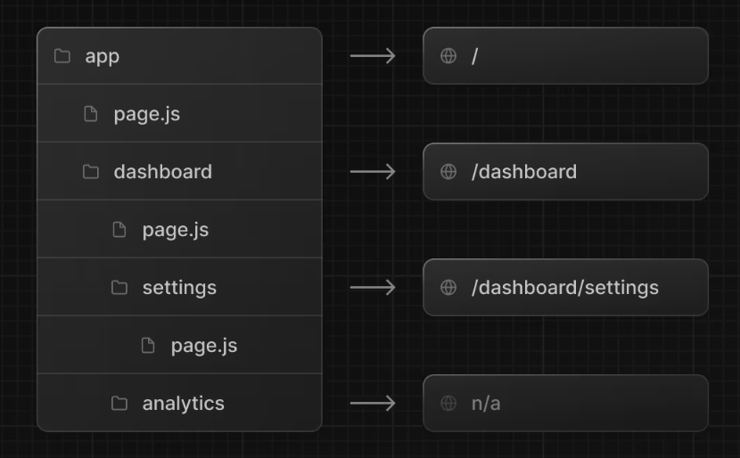

# Defining Routes

> Next.js 애플리케이션에서 경로를 정의하고 구성하는 방법을 안내

## Creating Routes

- Next.js는 폴더를 사용하여 경로를 정의하는 파일시스템 기반의 라우터를 사용
- 각 폴더는 URL segment에 매핑되는 route segment를 나타냄
- 폴더를 서로 중첩하면 중첩 경로를 만들 수 있음

</img>

- 특수한 <code>page.js</code> 파일은 경로 구간을 공개적으로 접근할 수 있도록 하는데 사용

</img>

- 위 폴더 경로에서는 <code>/dashboard/analytics</code> URL 경로는 <code>analytics</code>에 <code>page.js</code> 파일이 없기때문에 공개적으로 액세스할 수 없음

## UI 만들기

- <code>특수 파일 규칙</code>은 각 경로 세그먼트에 대한 UI를 만드는데 사용

- 예를들어, 첫 번째 패이지를 만들려고 하면 app directory 안에 page.js를 추가하고 React 컴포넌트를 내보냄

```typescript
// app/page.tsx
export default function Page() {
  return <h1>Hello, Next.js!</h1>;
}
```

### 특수 파일 규칙

<code>layout</code> - 세그먼트 및 해당 자식에 대한 공유 UI
<code>page</code> - 경로의 고유한 UI를 제공하고 경로를 공개적으로 액세스 가능하게 만듬  
<code>loading</code> - 세그먼트 및 해당 자식에 대한 UI 로딩
<code>not-found</code> - 세그먼트 및 해당 자식에 대한 UI를 찾을 수 없음
<code>error</code> - 세그먼트 및 해당 자식에 대한 오류 UI
<code>golbal</code>-error - 글로벌 오류 UI
<code>route</code> - 서버 측 API 엔드포인트
<code>template</code> - 전문화된 재렌더링 레이아웃 UI
<code>default</code> - 병렬 경로에 대한 풀백 UI
