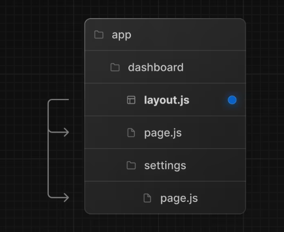

# Pages And Layouts

> 특수 파일 layout.js, page.js, template.js를 사용하면 경로에 대한 UI를 만들 수 있음

## Pages

- 페이지는 경로에 고유한 UI
- 기본적으로 page.js 파일에서 구성요소를 내보내 페이지를 정의
  </img>

```typescript
// app/page.tsx is the UI for the '/' URL
export default function Page() {
  return <h1>Hello, Home page!</h1>;
}
```

```typescript
// app/dashbord/page.tsx is the UI for the '/dashbord' URL
export default function Page() {
  return <h1>Hello, Dashbord Page!</h1>;
}
```

## Layouts

- 레이아웃은 여러 경로 간에 공유되는 UI
- 기본적으로 layout.js 파일에서 React 구성요소를 내보내 레이아웃을 정의

레이아웃은 <code>/dashboard</code>와 <code>/dashboard/settings</code>페이지로 공유됨
</img>

```typescript
// app/dashbord/layout.tsx
export default function DashboardLayout({
  children, // will be a page or nested layout
}: {
  children: React.ReactNode;
}) {
  return (
    <section>
      {/* Include shared UI here e.g. a header or sidebar */}
      <nav></nav>
      {children}
    </section>
  );
}
```

### Root Layout (Required)

- 루트 레이아웃은 app 디렉토리의 최상위 수준에서 정의되며 모든 경로에 적용됨
- <code>html</code> 및 <code>body</code> 태그를 포함해야함
- 서버에서 반환된 초기 HTML을 수정할 수 있음

```typescript
// app/layout.tsx
export default function RootLayout({
  children,
}: {
  children: React.ReactNode;
}) {
  return (
    <html lang="en">
      <body>
        {/* Layout UI */}
        <main>{children}</main>
      </body>
    </html>
  );
}
```

### Nesting Layouts

- 기본적으로 폴더 계층의 레이아웃은 중첩되어 있으며, 이는 자식 레이아웃을 prop을 통해 래핑한다는 것을 의미

<code>/dashboard</code>경로에 대한 레이아웃을 만들려면 새로운 <code>layout.js</code>파일을 <code>dashboard</code>폴더 안에 추가해야함

</img>

```typescript
// app/dashboard/layout.tsx
export default function DashboardLayout({
  children,
}: {
  children: React.ReactNode;
}) {
  return <section>{children}</section>;
}
```

> 위의 두 레이아웃을 결합하면 루트 레이아웃(app/layout.js)이 대시보드 레이아웃(app/dashboard/layout.js)을 래핑하게 되고 대시보드 레이웃은 경로 세그먼트를 app/dashboard/\* 내부에 래핑하게 됨

</img>
