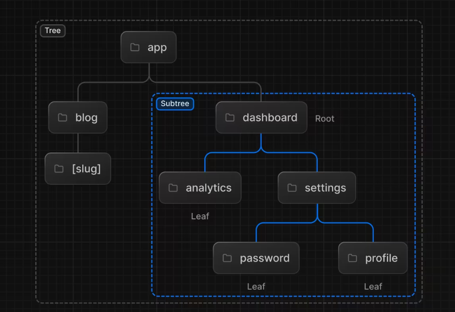
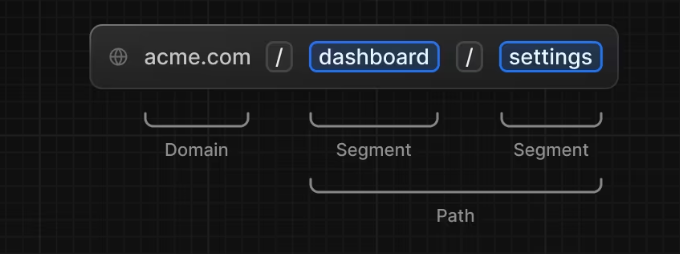
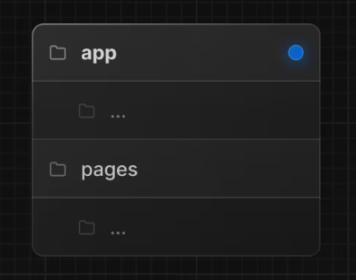
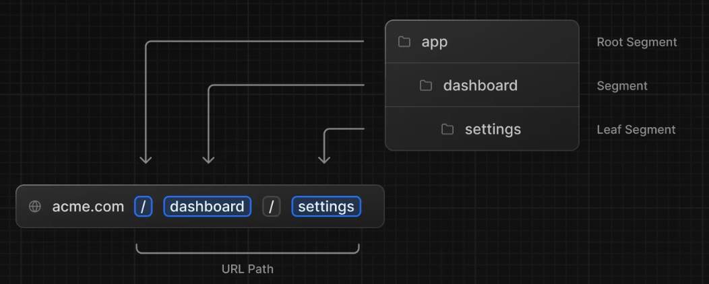
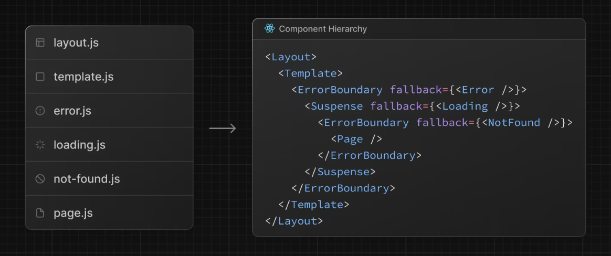
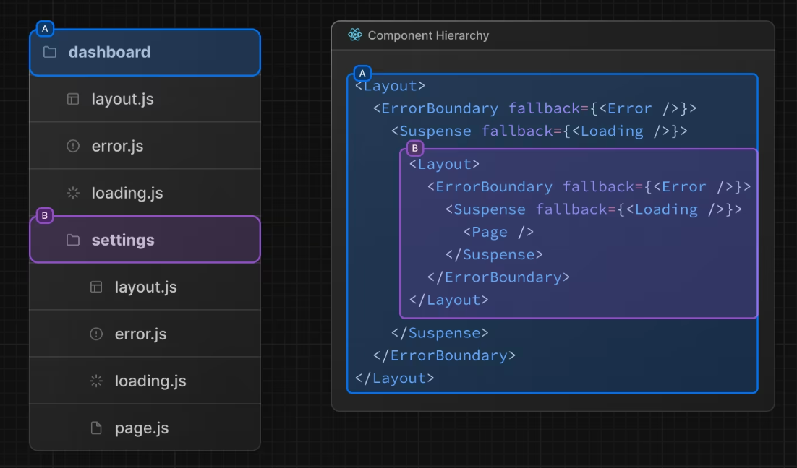
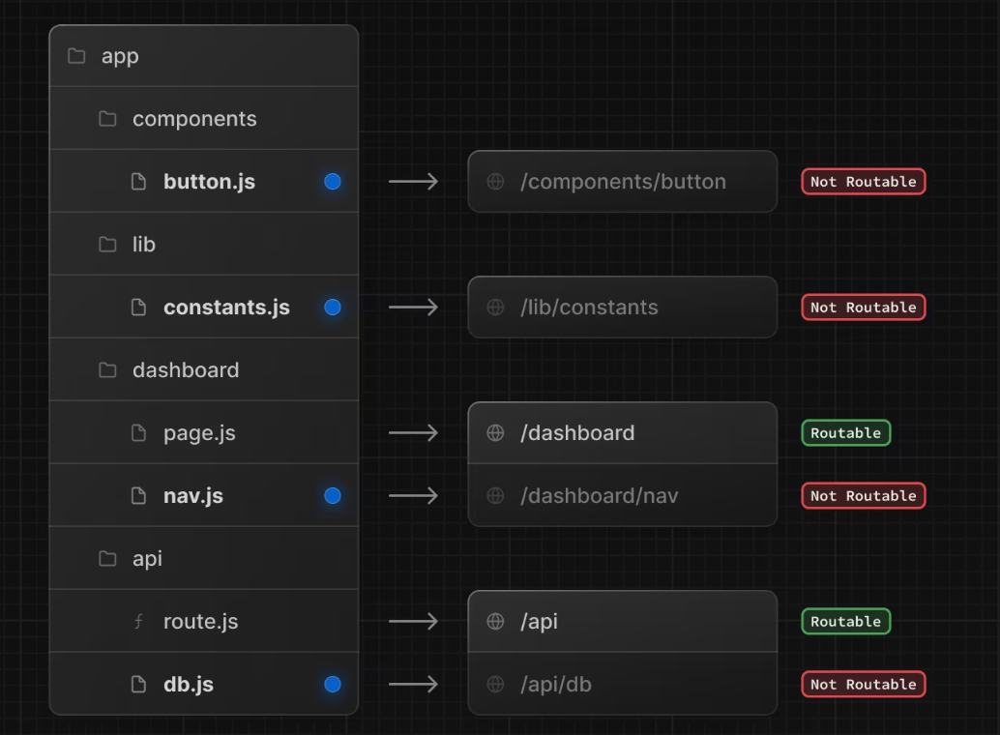

# Routing Fundamentals

> 웹 라우팅의 기본개념과 Next.js에서 라우팅을 처리하는 방법

## Terminology

</img>

- Tree: 계층적 구조를 시각화하기 위한 규칙
- Subtree: 트리의 일부로, 새로운 루트(처음)에서 시작해서 리프(마지막)에 끝남
- Root: 루트 레이아웃과 같은 트리 또는 서브트리의 첫번째 노드
- Leaf: URL 경로의 마지막 세그먼트와 같이 자식이 없는 서브트리의 노드

</img>

- URL Segment: 슬래시로 구분된 URL 경로의 일부
- URL Path: 도메인 뒤에 오는 URL의 일부(세그먼트로 구성)

## The <code>app</code> Router

- 13 버전에서 React Server Component 기반으로 구축
- 공유 레이아웃, 중첩 라우팅, 로딩 상태, 오류 처리 등 지원

- <code>app</code>이라는 새 디렉토리에서 작동
- <code>app</code> 디렉토리는 <code>pages</code> 디렉토리와 함께 동작해서 점진적인 채택(?)을 허용함
- 이전 동작에 대한 페이지 디렉토리에 다른 경로를 유지하는 동안 애플리케이션의 일부 경로를 새로운 동작으로 선택할 수 있음
  > 알아두면 좋은 점 : App Router는 Pages Router보다 우선시하고 디렉도리 간 경로는 동일한 URL 경로로 해결되어서는 안되며 충돌을 방지하기 위해 빌드 타임 에러가 발생함
  > </img>

## Roles of Folders and Files

> Next.js는 파일 시스템 기반의 라우터를 사용

#### Folders

- 폴더는 라우터를 정의하는데 사용
- 라우터는 루트 폴더에서 <code>page.js</code> 파일을 포함하고 최종 리프 폴더까지 파일시스템 계층을 따르는 중첩된 폴더의 단일 경로임.

#### Files

- 파일은 경로 세그먼트에 표시되는 UI를 만드는데 사용

## Route Segments

</img>

- 경로 안에 있는 각각의 폴더는 경로 세그먼트를 나타냄.
- 각각의 루트 세그먼트는 URL 경로의 해당 세그먼트에 매핑됨

## Nested Routes

- 중첩된 경로를 만들려면 각각의 폴더를 중첩할 수 있음
- 예를들어, 앱 디렉터리에 두 개의 새 폴더를 중첩해서 새로운 <code>/dashboard/settings</code> 경로를 추가할 수 있음
  - <code>/</code> - 루트 세그먼트
  - <code>dashboard</code> - 세그먼트
  - <code>settings</code> - 리프 세그먼트

## File Conventions

> Next.js는 중첩된 경로에서 특정 동작을 갖는 UI를 생성하기 위한 특별한 파일 세트를 제공

- <code>layout</code> - 세그먼트 및 해당 자식에 대한 공유 UI
- <code>page</code> - 경로의 고유한 UI이고 공개적으로 접근하기 쉬운 경로를 만듬
- <code>loading</code> - 세그먼트 및 해당 자식에 대한 로딩 UI
- <code>not-found</code> - 세그먼트 및 해당 자식에 대한 Not Found UI
- <code>error</code> - 세그먼트 및 해당 자식에 대한 Error UI
- <code>global-error</code> - 글로벌 Error UI
- <code>route</code> - 서버 측 API 엔드포인트
- <code>template</code> - 전문화된 재렌더링 레이아웃 UI
- <code>default</code> - 병렬 경로에 대한 풀백 UI

## Component Hierarchy

> 루트 세그먼트의 특수 파일에 정의된 React Component는 특정 계층 구조로 렌더링 됨

</img>

- <code>layout.js</code>
- <code>template.js</code>
- <code>error.js</code> (React error boundary)
- <code>loading.js</code> (React suspense boundary)
- <code>not-found.js</code> (React error boundary)
- <code>page.js</code> or 중첩 <code>layout.js</code>

> 중첩된 경로에서 세그먼트의 구성요소는 부모 세그먼트의 구성요소 안에 중첩됨

</img>

## Colocation

- 특수파일 외에도 앱 디렉터리의 폴더 내에 자체 파일(e.g. 컴포넌트, 스타일, 테스트 등)을 같은 위치에 배치할 수 있는 옵션이 있음
- 폴더가 경로를 정의하는 동안 <code>page.js</code> 또는 <code>Route.js</code>에서 반환된 콘텐츠만 공개적으로 주소를 지정할 수 있기 때문

</img>

## Advanced Routing Patterns

> 앱 라우터는 고급 라우팅 패턴을 구현하는데 도움이 되는 일련의 규칙을 제공함

#### Parallel Routes

- 독립적으로 탐색할 수 있는 동일한 뷰에 두개 이상의 페이지를 동시에 보여줄 수 있음
- 자체 하위 탐색이 있는 분할 뷰에 사용할 수 있음 (e.g 대시보드)

#### Intercepting Routes

- 경로를 가로채고 다른 경로의 컨텍스트에 표시할 수 있음
- 현재 페이지의 컨텍스트를 유지하는것이 중요할 때 이것을 사용할 수 있음
- e.g 하나의 작업을 편집하거나 피드에서 사진을 확장하는 동안 모든 작업을 볼 수 있음

> 이러한 패턴을 사용하면 더 풍부하고 복잡한 UI를 구축할 수 있고, 역사적으로 소규모 팀과 개별 개발자가 구현하기 복잡했던 기능을 민주화할 수 있음
